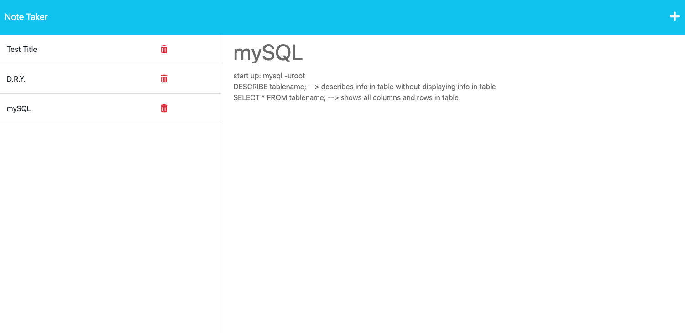

# note-taker-app
## Description
The goal of this project was to create a functional server for pre-existing front end code to create a note taking application. This project utilizes JavaScript and Express.js to allow users to create notes, read notes, and delete notes. The notes themselves are transferred and saved to a db.json file in the db folder of the root directory of the application. The server for this app functions with GET, POST, and DELETE requests.
## Deployed Application
Follow this link to view the web app!

[Note Taker App](https://stormy-fortress-54603-8d3de02ba2d7.herokuapp.com/)

## Usage
- Follow the link to the notes page to view all created notes on the left side of the page and an area to add new notes on the right side of the page
- Click the writing icon on the upper right corner of the screen or enter text into the fields for new notes (including title and text content) to enter new notes. Then click the save icon in the upper right hand corner to save new notes
- Click on a preexisting note title on the left hand side to view the note's content on the right side of the screen
- Click the delete icon next to each preexisting note on the left hand side of the screen to delete notes
## Resources
[Express.js](https://expressjs.com/)